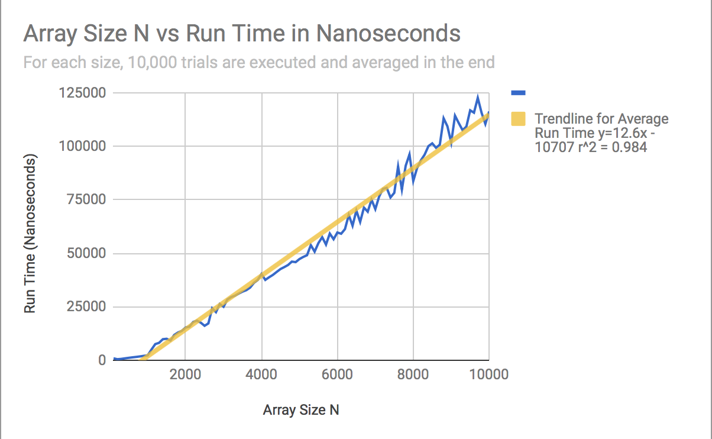

# teamAnything #
APCS2 pd02

L#00 -- But What Does the Data Say?

Ricky Lin, Bo Hui Lu, Susan Lin

## Hypothesis ## 
As the size of the matrix, n, increases the runtime will increase at a **linear rate**.

## Background: The Big Oh ##
MatrixFinder.java should have a runtime of **O(n)**.

type in javac MFDriver.java

then type in java MFDriver > data.csv

## Methodology (repeat for increasing sample size by a factor of 100) ##
Using the same sample size, run 10K trials, but with incrementing elements. Check the runtime of those trials and document it in a .csv file.

## Results ##
(https://docs.google.com/spreadsheets/d/1UMSfhXNJ7QH35i69T8W8c4uGV2bFzeNfo48xeQPfikQ/edit?usp=sharing "Google Sheets Link to Experimental Data")

The data shows that the runtime is roughly linear, with few distinct points that do not conform to the trend.

We were able to formulate a line of best fit, **12.6X - 10707 = Y with a coefficient of determination (R^2) of 0.984**.  

## Conclusions ##
The function runs in linear time with negligble deviations.

The minor deviations were mostly likely caused by the randomness of the target number which could have led to either a worst or best case scenario. 
